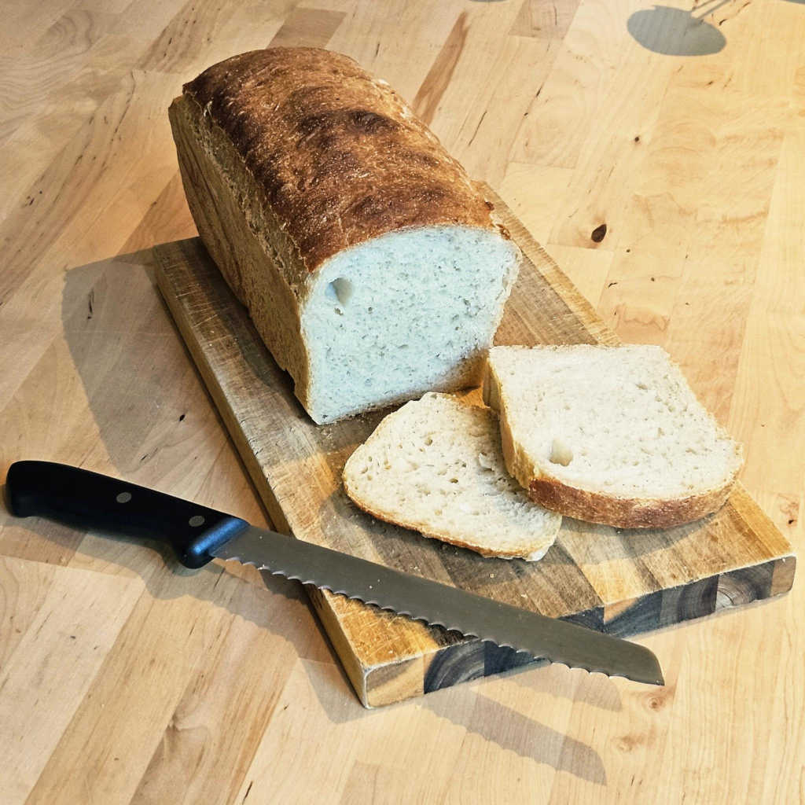
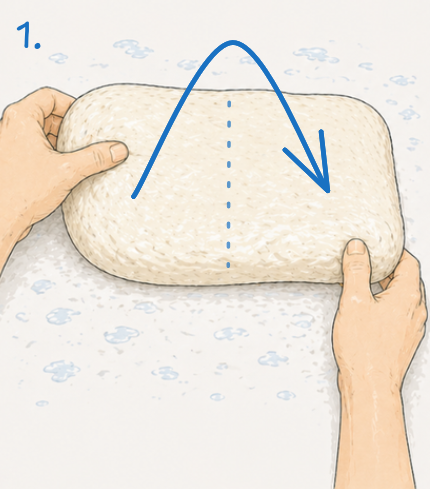
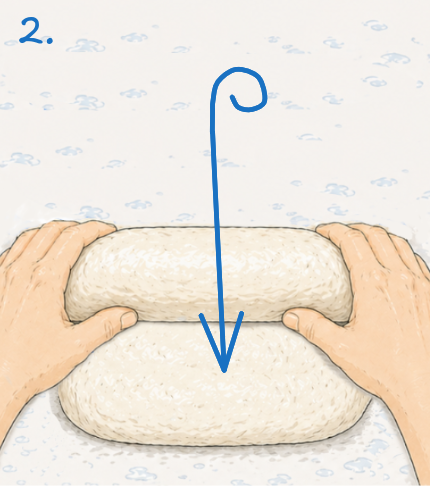

# High Hydration Tin Loaves

70% hydration, two tins using instant yeast. Same day baking.

Tins: 30 cm x 10 cm x 8 cm

## Ingredients:

- 1300 g T65 flour, no additives (11.8% protein content)
- 910 ml Water at 30°C (70%)
- 10 g instant yeast, e.g., "Bruggeman Instant" (0.77%)
- 22 g Salt (1.7%)

## Steps

- 00:00 — Mix flour, salt, dry yeast first. Then, add the water at 30°C and mix
  for ~10 minutes.
    - No dry flour should remain.
    - The dough will be very sticky, it's easier to mix it inside a bowl.
    - Water temperature is important for the timings, use a thermometer.
    - Higher temperatures will speed up the proofing but compromise the
      structure.

- 00:10 — Rest for 10 minutes: Leave covered.
    - Dough will already feel a bit less sticky.

- 00:20 — Stretch and fold, set #1: Wet hands, no flour. Repeat four times, 
  rotating the bowl 90° (one full turn).
    - Stretch and fold gently, always inside the same container.

- 00:50 — Stretch and fold, set #2: Repeat another four stretch-and-folds,
  rotating 90° each time.

- 01:20 — Stretch and fold, set #3: Repeat one last time. Then leave alone,
  covered.

- 01:50 — Bulk fermentation: Go for a 80% volume increase in comparison with the
  starting wet mix.
    - At 22°C room temperature, that's approximately 45 minutes after the last
      fold.
    - Go primarily by volume, not the clock.

- 02:20 — Divide and pan: Fold and roll into well-oiled tins.
    - With wet hands during this whole step, gently drop the dough into a
      lightly wet surface.
    - Divide the dough in two equal parts.
    - Gently fold the dough once onto itself, like closing a book.
  
      
  
    - Once folded, 90° from the fold direction, make a roll towards you. This
      requires some patience as the dough will be slippery.
     
      
  
    - Flip each roll into a well-oiled tin, with the seam towards the bottom.
    - It might be better to use baking paper instead of oil. The loaves WILL 
      stick to the tins if they are not smooth and well oiled.

- 02:25 — Final proof: At 22°C room temperature for approximately 1 h.
    - Cover the tins with a plastic film or use a proofing cover.
    - Wait until the dough reaches the rim of the tins.
    - Half way through this final proofing is a good time to preheat the oven.

- 03:25 — Load tins in a well-preheated oven at 230°C.
    - Immediately pour 100 ml of boiling water into the bottom tray of the oven
      for a better crust.
    - Bake for 15 min.

- 03:40 — Finish bake: Drop to 210°C and bake for 20 more minutes until deep
  golden brown.
    - The internal temp of the loaf (using a probe thermometer) should reach
      96°C.

- 04:00 — Cool down: Tip out of tins immediately.
    - Let to cool without covering.
    - Wait 1 hour before cutting.

